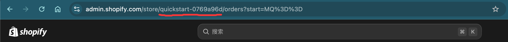
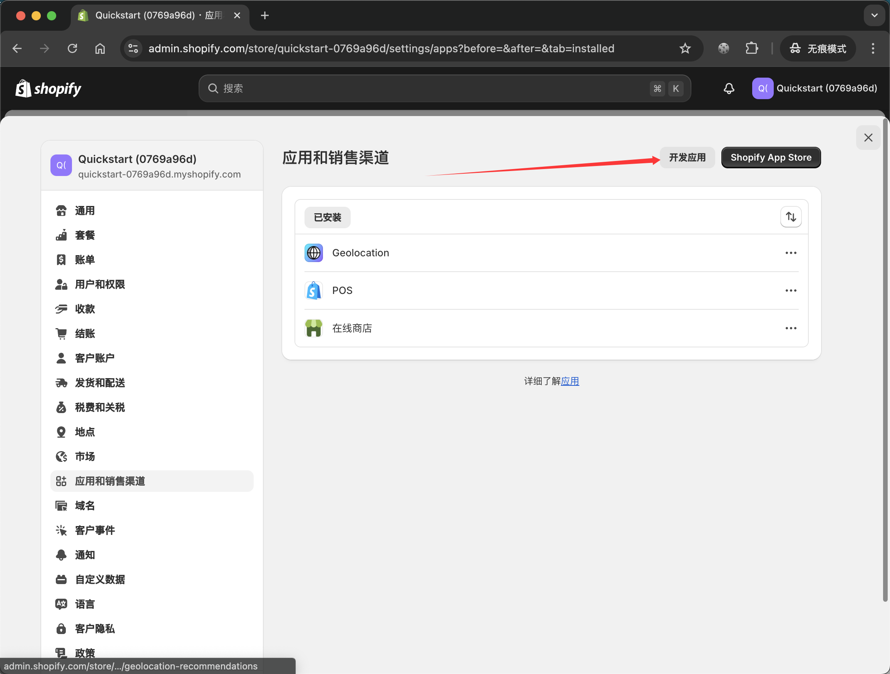
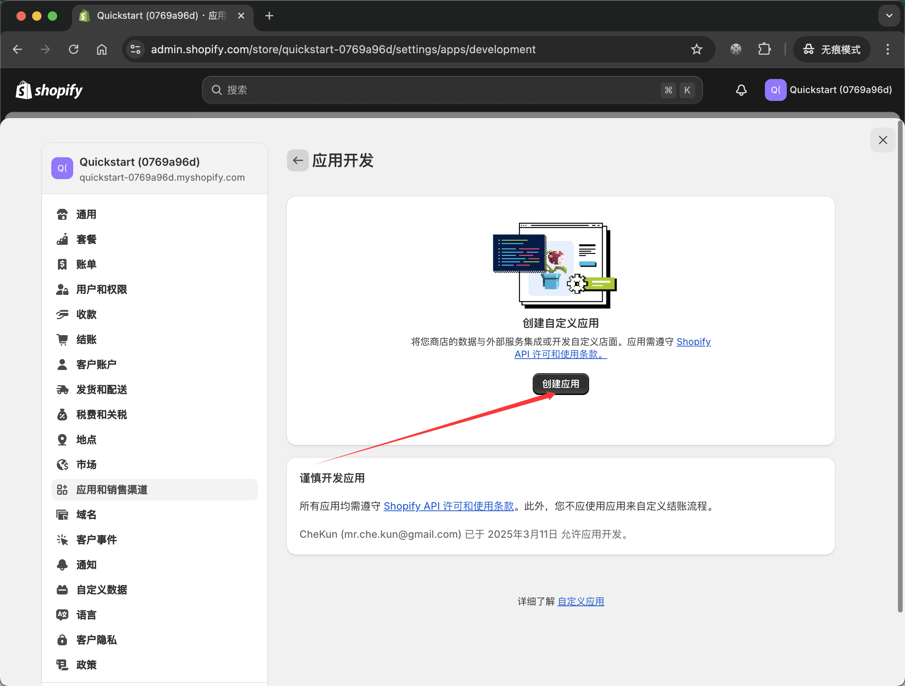
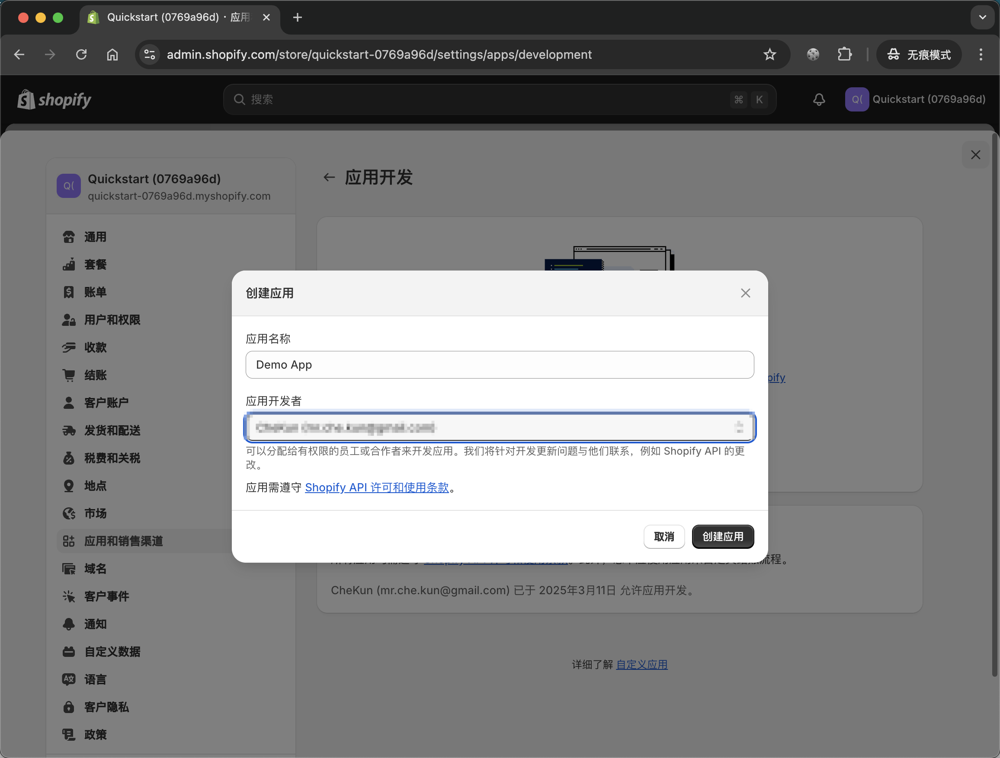
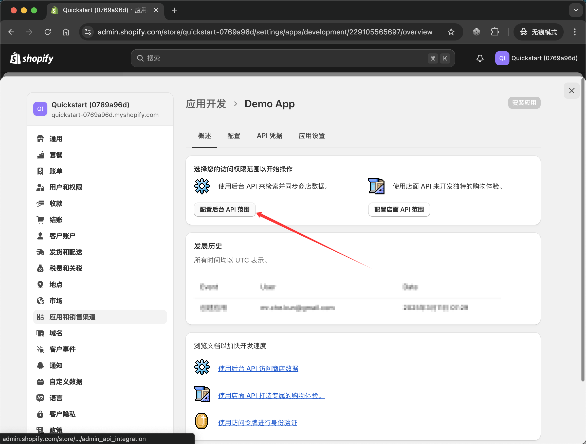
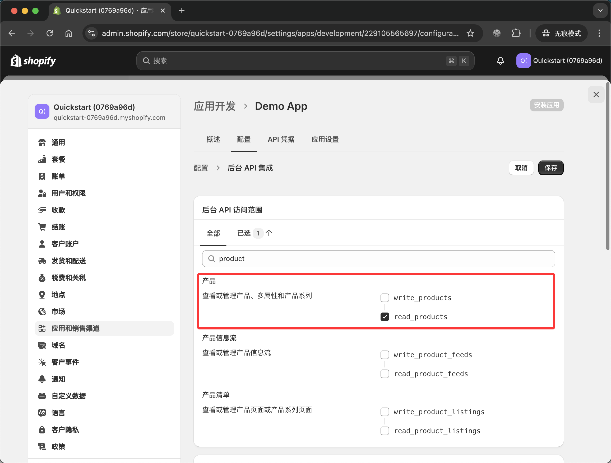
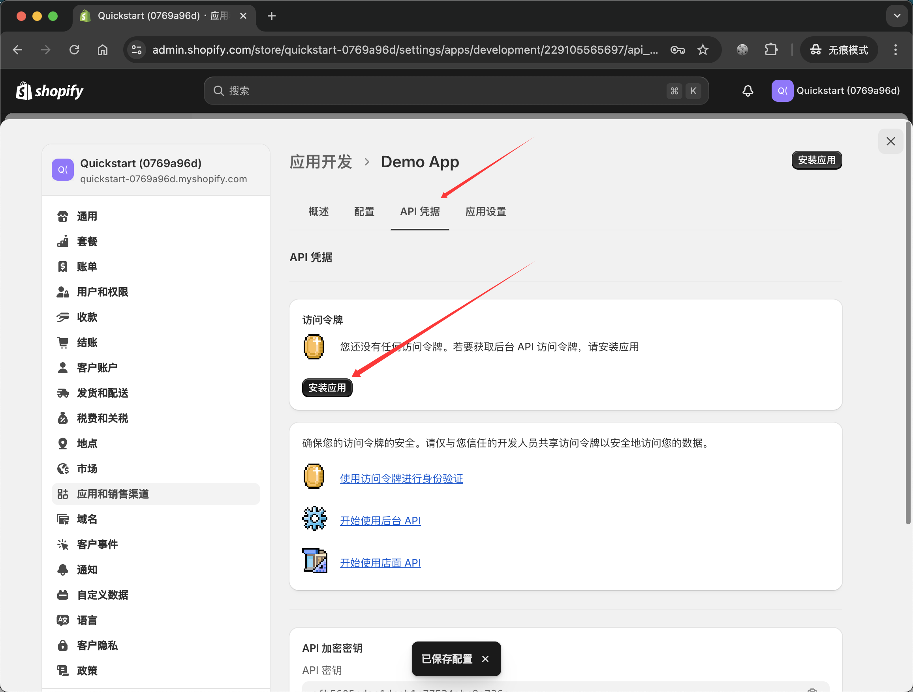
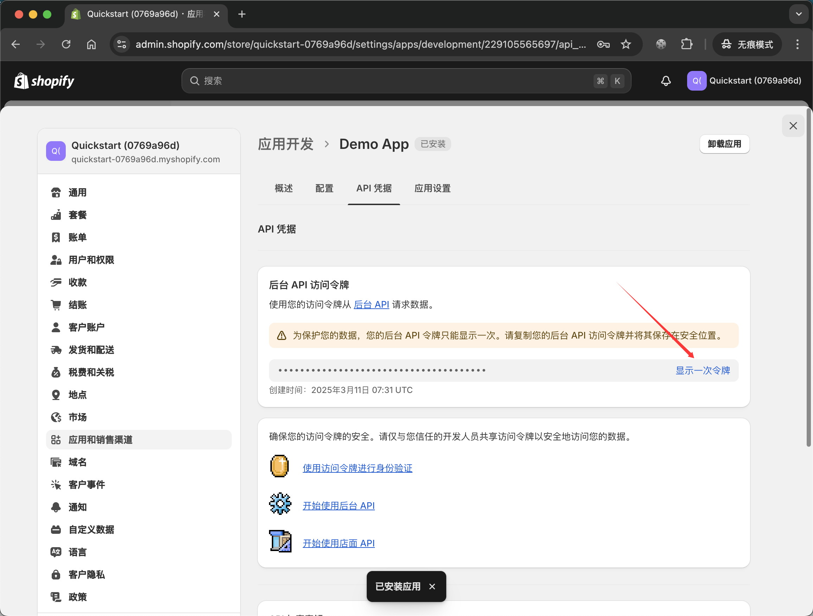
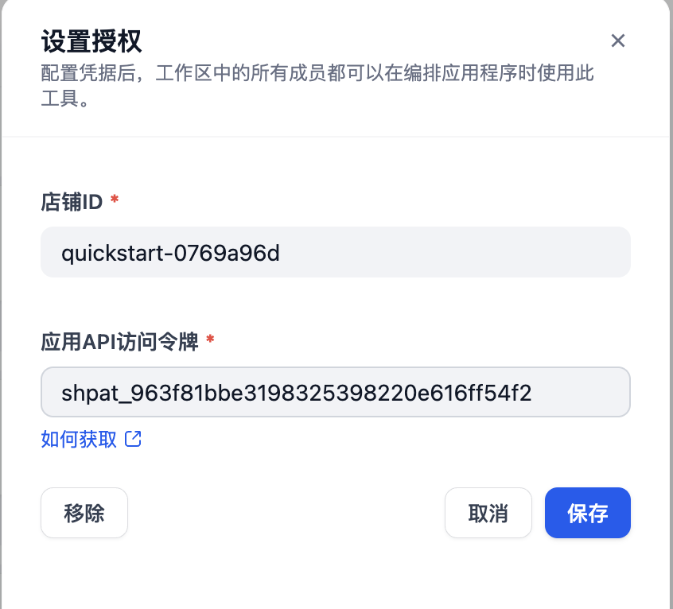

# Shopify

## Overview

A tool in Dify that helps you interact with Shopify store data 🔧

## Implemented Tools
  
  - Query product information from your store

## Configuration

### 1. Get Store ID

After logging into the Shopify admin panel, the store ID is the part shown in the URL as illustrated below.

### 2. Create Store App and Get Admin API Access Token

> If you already have a store app, you can skip this step or create a new one.

> When setting access scopes, only select necessary permissions, such as read access to products for now.

### 3. Enter Store ID and Access Token in Dify

Click on plugins, click on the Shopify tool, then click on set authorization.

### 4. Using the Tool

Use according to your needs

> For example, you can have AI analyze your product icons, product titles and descriptions, and whether product prices can be optimized, etc.
